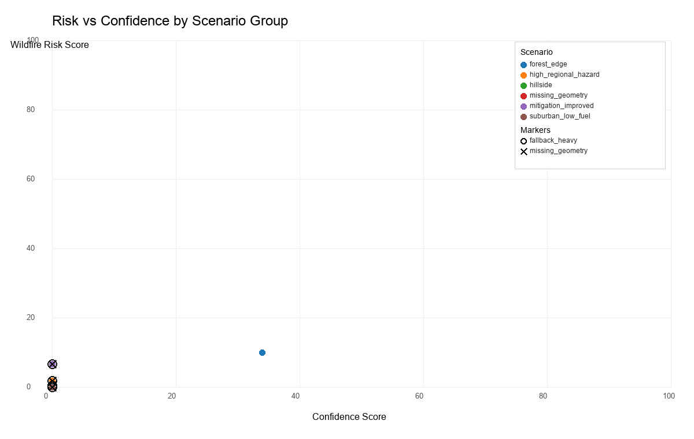
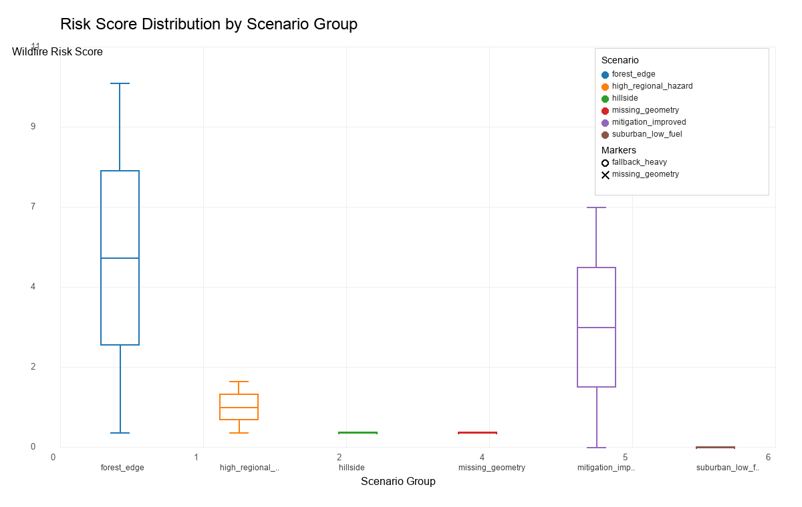
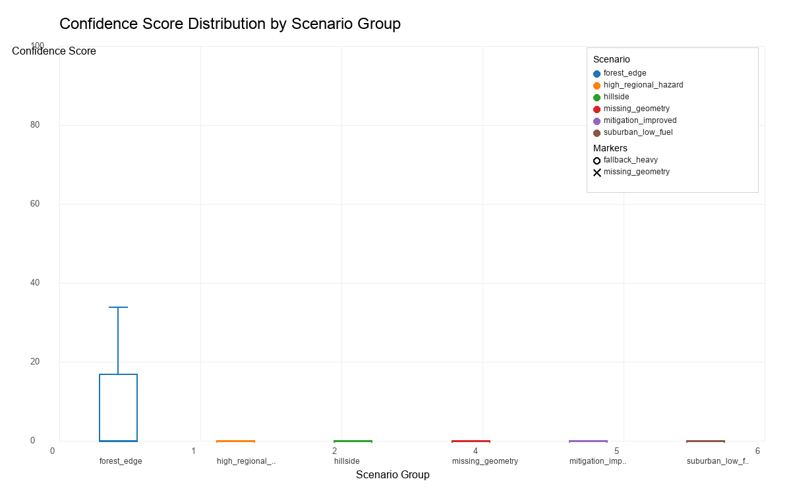
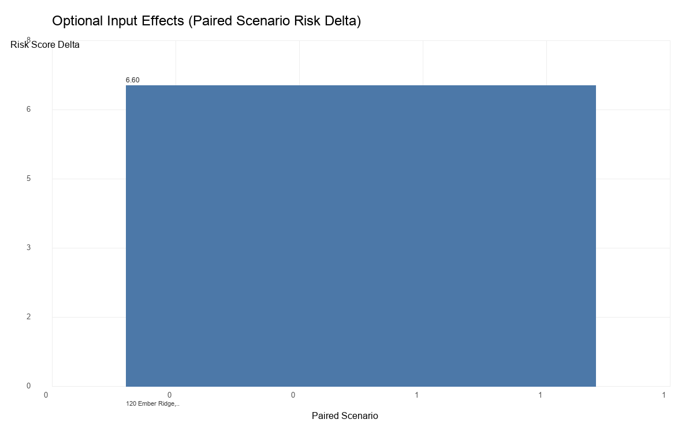

# Benchmark Summary

## Short Summary
- Loaded **13** benchmark assessments from `reports/benchmark_results.csv`.
- Mean wildfire risk score: **1.82** (median **0.40**).
- Mean confidence score: **2.62** (median **0.00**).
- Rows with low risk + low confidence (risk <= 5 and confidence <= 10): **9**.
- Rows flagged `fallback_heavy`: **12**.
- Rows flagged `missing_geometry`: **12**.
- Suspiciously low high_regional_hazard rows were flagged in diagnostics.
- Scenario groups observed: forest_edge (3), high_regional_hazard (2), hillside (2), missing_geometry (1), mitigation_improved (2), suburban_low_fuel (3).

## Key Findings
- A large share of low risk outputs occur with very low confidence, so risk values should not be interpreted alone.
- Fallback-heavy runs are common and align with weaker confidence and sparse geometry evidence.
- Scenario consistency is uneven: high regional hazard-labeled rows include very low risk values in this output.

## Figures

## Key Takeaways for Model Reliability
- Confidence and data-availability context should be read together with risk score.
- Fallback-heavy or missing-geometry evidence can reduce comparability across properties.
- Scenario intent labels need mapped scoring inputs to validate those scenarios reliably.

## Next Steps (Non-invasive)
- Add reporting guardrails that prominently flag low-confidence + fallback-heavy results.
- Improve benchmark fixtures so scenario hints map to accepted scoring attributes.
- Prioritize data-availability improvements (geometry coverage, missing layer fill) to reduce fallback-heavy runs.
